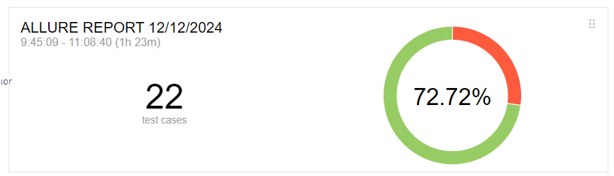

# Отчет по тестированию

**Краткое описание**

Было проведено тестирование сервиса по покупке тура. Тестирование проводилось
с применением следующих технологий: 
- Java;
- Selenide;
- Allure;
- Gradle;
- Faker;

**Количество тест-кейсов**

Было разработано 2 тест-кейса:
- Тест-кейс покупки тура;
- Тест-кейс покупки тура в кредит;

**Процент успешных и не успешных тест-кейсов**

**Общие рекомендации**

Рекомендации по исправлению багов:
- Необходимо устранить баг с валидацией месяца при покупке тура;
- Необходимо устранить баг с валидацией владельца карты при покупке тура;
- Необходимо устранить баг с обработкой отказа в backend сервере при покупке тура;
- Необходимо устранить баг с валидацией месяца при покупке тура в кредит;
- Необходимо устранить баг с валидацией владельца карты при покупке тура в кредит;
- Необходимо устранить баг с обработкой отказа в backend сервере при покупке тура в кредит;